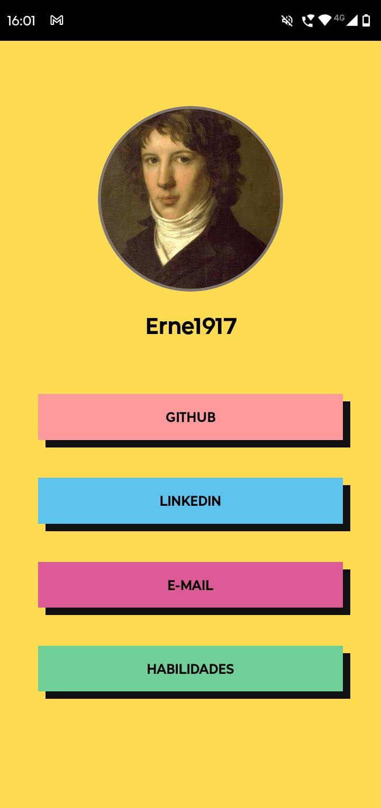

# Mock-Mobile-Portfolio

Projeto desenvolvido como parte de um desafio da Digital Innovation One (DIO).
O objetivo é criar uma página simples e responsiva no estilo Linktree, listando links pessoais e redes sociais.

<div style="display:flex; gap:1rem;">
    


</div>

## Funcionalidades

- Lista de links clicáveis para redes sociais e sites pessoais.

- Layout responsivo adaptado para dispositivos móveis.

- Design limpo e minimalista.

## Como Executar

1. **Clonando o repositório:**

   ```bash
   https://github.com/Erne1984/Mock-Mobile-Portfolio-DIO.git
   ```

2. **Acesse a pasta do projeto:**

   ```bash
   cd Mock-Mobile-Portfolio
   ```

3. **Instale as dependências:**

   ```bash
   npm install
   ```

4. **Instale as dependências:**
   ```bash
   npx expo start
   ```

## Licença

Este projeto está sob a licença MIT.
